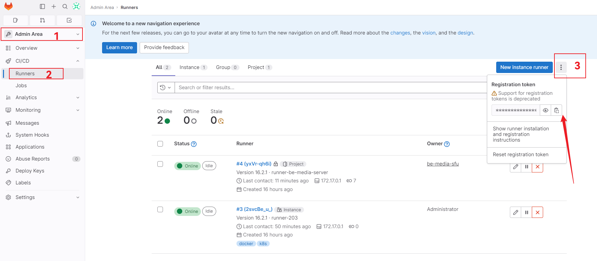

# gitlab-ci-docker

## setup
* docker
* self-hosted docker registry
* self-hosted gitlab
* self-hosted gitlab-runner


### docker registry 部署

```shell
docker run -d --name registry -p 5000:5000 \ 
    -v /srv/docker-registry:/var/lib/registry \
    --restart=always \
    registry
```


**镜像操作**

```shell
docker build -t 127.0.0.1:5000/my-server:latest .
docker push 127.0.0.1:5000/my-server:latest

# 或者对已存在的镜像新增标签
docker tag ubuntu:latest 127.0.0.1:5000/ubuntu:latest
docker push 127.0.0.1:5000/ubuntu:latest
```


**REST API**

> https://docs.docker.com/registry/spec/api/


**允许镜像删除**

编辑 `/etc/docker/registry/config.yml`：

```yaml
storage:
...
  delete:
    enabled: true
```


### docker 配置私服

编辑 `/etc/docker/daemon.json`：

```json
{
  "insecure-registries": [
    "<your-registry-host>:<your-registry-port>"
  ]
}
```


### GitLab 部署

1、[GitLab Docker images](https://docs.gitlab.com/ee/install/docker.html)

2、启动 Gitlab

```shell
export GITLAB_HOME=/srv/gitlab # 也可以写入 .bashrc 或者 .zshrc

docker run -d \
  --hostname <your-host>\
  -p 4430:443 -p 8000:80 -p 2200:22 \
  --name gitlab \
  --restart always \
  --volume $GITLAB_HOME/config:/etc/gitlab \
  --volume $GITLAB_HOME/logs:/var/log/gitlab \
  --volume $GITLAB_HOME/data:/var/opt/gitlab \
  --shm-size 256m \
  gitlab/gitlab-ce:latest
```

3、获取 root 密码

```shell
docker exec **-it** gitlab grep 'Password:' /etc/gitlab/initial_root_password
```


**自定义端口配置**

> 如果对 http 和 ssh 端口进行了修改，必须要修改配置文件中相应的内容。

```shell
vim /etc/gitlab/gitlab.rb
# 如果是 docker 镜像内部
editor /etc/gitlab/gitlab.rb
```

1、external_url 修改 `external_url 'http://host:port'`

2、ssh 端口修改 `gitlab_rails['gitlab_shell_ssh_port']=port`

> 如果只做 external_url 处端口的修改，会发现无法访问 webui，因为 gitlab 镜像内部的 nginx 默认会监听 external_url 的端口号，因此还需要进一步修改 nginx 监听的端口。

3、修改 `nginx['listen_port']=80`


### GitLab Runner 部署

**步骤**

* 启动 Runner

* 获取 Registration Token

* 注册 Runner

<br>

1、docker 启动

```shell
docker run -d --name gitlab-runner --restart always -v /srv/gitlab-runner/config:/etc/gitlab-runner -v /var/run/docker.sock:/var/run/docker.sock gitlab/gitlab-runner:latest
```

2、获取 Registration Token

2.1、如果是在项目中配置 Runner


2.2、如果配置共享 Runner



3、注册 Runner

```shell
docker exec -it gitlab-runner bash
gitlab-runner register # 接下来按照步骤填写即可。
```


## Docker Executor 踩坑

`.gitlab-ci.yml` 内容如下：

```yaml
build-image-job:
  stage: build
  image: docker:latest
  services:
    - docker:dind
  script:
    - docker info
    - docker build -t $CI_PROJECT_NAME:$CI_COMMIT_TAG .
    - echo "docker 镜像 $CI_PROJECT_NAME:$CI_COMMIT_TAG 打包完成。"
    - docker images
    - echo "docker 镜像上传"
    - docker tag $CI_PROJECT_NAME:$CI_COMMIT_TAG $DOCKER_REGISTRY/$CI_PROJECT_NAME:$CI_COMMIT_TAG
    - docker push $DOCKER_REGISTRY/$CI_PROJECT_NAME:$CI_COMMIT_TAG
```

但是在执行到 docker 相关命令的时候报错：*error during connect: Post http://docker:2375/: dial tcp: lookup docker on x.x.x.x:53: no such host*。

排查许久，解决方法如下：

修改 GitLab Runner 的配置文件 `/etc/gitlab-runner/config.toml`：

```toml
[runners.docker] # 在此部分添加下面的内容
  privileged = true
  volumes = ["/var/run/docker.sock:/var/run/docker.sock"]
```

> 很奇怪，在启动 GitLab Runner 的时候分明已经添加了 `/var/run/docker.sock` 映射。